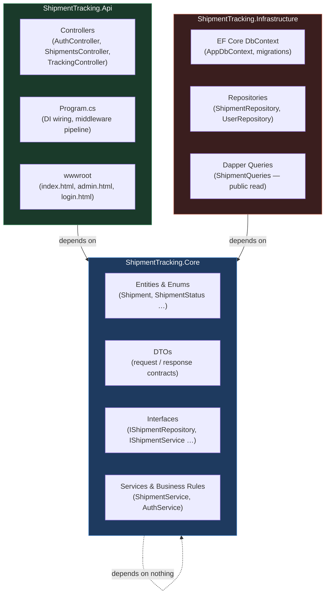
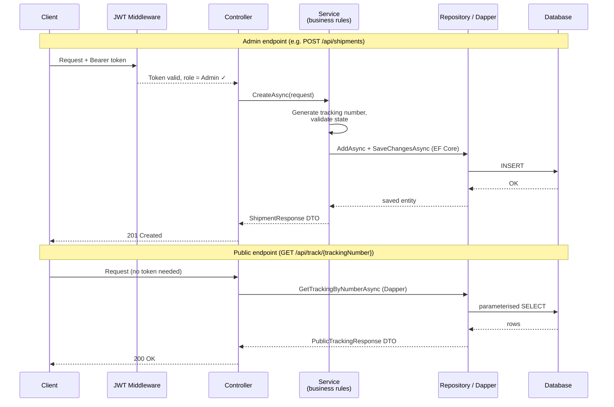

# Shipment Tracking API

A shipment and cargo tracking system built as a layered ASP.NET Core Web API, with a public tracking page and a JWT-protected staff admin panel.

---

## Live Demo

🔗 **https://shipment-tracking-as7t.onrender.com**

| Page | Access |
|---|---|
| Public tracking page | Open to anyone — look up any shipment by tracking number |
| Admin panel | Requires login — credentials available on request |

**How to try it:**
1. Request admin credentials and log in to create a new shipment.
2. Copy the generated tracking number.
3. Open the public page, enter the tracking number, and watch the status timeline update as the shipment moves through each stage.

> **Note:** Hosted on a free tier — the first request after a period of inactivity may take **30–60 seconds** (cold start). Demo data may reset on redeploy.

---

## Tech Stack

| Layer | Technology |
|---|---|
| Language / Framework | C# · .NET 10 · ASP.NET Core Web API |
| ORM / Query | Entity Framework Core (writes) · Dapper (public read query) |
| Database | MS SQL Server LocalDB (local dev) · SQLite (deployed) |
| Auth | JWT Bearer tokens · role-based authorization (`Admin` role) |
| Frontend | Bootstrap 5 · jQuery · plain HTML/CSS (no SPA framework) |
| Containerisation | Docker |
| Hosting | Render (free tier) |

---

## Architecture

### Layered Dependency Structure



**How to read this:** The three coloured boxes are separate C# projects. Arrows mean "depends on". `Core` sits in the middle and depends on nothing — it is pure business logic. Both `Api` and `Infrastructure` depend on `Core` (they implement or consume its interfaces), but they never depend on each other. This keeps business rules independent of frameworks and databases, and makes each layer easy to test in isolation.

---

### Request Flow



**How to read this:** Every admin request (`/api/shipments`) is intercepted by the JWT middleware before it reaches the controller — an invalid or missing token returns `401` immediately. Business rules (status-transition validation, tracking-number generation) live exclusively in the `Service` layer, keeping controllers thin. The public tracking endpoint (`/api/track/{tn}`) is fully anonymous and uses a lightweight Dapper query instead of loading the full EF entity graph.

---

## Project Structure

```
shipment_tracking/
├── ShipmentTracking.Api/                  # HTTP entry point
│   ├── Controllers/                       # Thin controllers — no business logic here
│   │   ├── AuthController.cs              # POST /api/auth/login
│   │   ├── ShipmentsController.cs         # CRUD for admin (JWT-protected)
│   │   └── TrackingController.cs          # GET /api/track/{tn} (anonymous)
│   ├── Program.cs                         # DI wiring, middleware pipeline, DB migration on startup
│   ├── wwwroot/                           # Frontend (served as static files)
│   │   ├── index.html                     # Public tracking page
│   │   ├── admin.html                     # Staff admin panel
│   │   └── login.html                     # Login page
│   └── appsettings.json                   # Non-secret config (JWT issuer, DB provider)
│
├── ShipmentTracking.Core/                 # Business logic — no EF, no HTTP, no secrets
│   ├── Entities/                          # Domain models (Shipment, ShipmentStatusHistory, AppUser)
│   ├── Enums/                             # ShipmentStatus (Created → … → Delivered)
│   ├── DTOs/                              # Request / response contracts crossing the API boundary
│   ├── Interfaces/                        # Abstractions (IShipmentRepository, IShipmentService …)
│   ├── Services/                          # Business rules: ShipmentService, AuthService
│   ├── Exceptions/                        # InvalidStatusTransitionException
│   └── Constants/                         # Roles.Admin — single source of truth for role strings
│
├── ShipmentTracking.Infrastructure/       # Data access — implements Core interfaces
│   ├── Data/                              # AppDbContext, EF migrations, AdminUserSeeder
│   ├── Repositories/                      # EF Core repositories (ShipmentRepository, UserRepository)
│   ├── Queries/                           # Dapper public read query (ShipmentQueries)
│   └── Migrations/                        # SQL Server migrations
│
├── ShipmentTracking.Migrations.Sqlite/    # Separate SQLite migration assembly (for Render deploy)
│   └── Migrations/                        # SQLite-specific EF migrations
│
├── Dockerfile                             # Multi-stage build for Render
├── journal/                               # Session-by-session dev notes
└── ShipmentTracking.slnx                  # Solution file
```

---

## Key Features

- **JWT authentication + role-based authorization** — staff log in via `POST /api/auth/login` and receive a signed Bearer token; all write endpoints require the `Admin` role claim.
- **Forward-only status-transition state machine** — `ShipmentService` enforces a strict one-way pipeline in the service layer:  
  `Created → AtCustoms → InTransit → OutForDelivery → Delivered`  
  Any attempt to skip or reverse a step returns a `400 Bad Request`.
- **Tracking-number generation** — unique numbers in the format `TR{yyyyMMdd}-{XXXXXX}` are generated and collision-checked before persisting.
- **Public anonymous tracking** — anyone can look up a shipment by tracking number and see its full status timeline; no token required.
- **EF Core writes + parameterized Dapper reads** — admin writes go through EF Core for type safety and change tracking; the high-traffic public read uses a lean parameterized Dapper query (SQL-injection safe, no ORM overhead).
- **Provider-aware data access** — a single `DatabaseProvider` config switch selects SQL Server (local dev) or SQLite (Render); migrations live in separate assemblies to keep EF happy with both providers.
- **Dockerized, deployed on Render** — multi-stage `Dockerfile`; migrations and admin-user seeding run automatically on startup.

---

## Running Locally

### Prerequisites

- [.NET 10 SDK](https://dotnet.microsoft.com/download)
- SQL Server LocalDB (included with Visual Studio, or install standalone)

### 1. Set required secrets

These are never stored in `appsettings.json` or committed to the repo.

```bash
cd ShipmentTracking.Api

dotnet user-secrets set "Jwt:Key"            "<your-strong-random-key-32-chars-min>"
dotnet user-secrets set "Seed:AdminUsername" "<your-admin-username>"
dotnet user-secrets set "Seed:AdminPassword" "<your-admin-password>"
```

### 2. Apply migrations

```bash
dotnet ef database update -s ShipmentTracking.Api
```

### 3. Run

```bash
dotnet run --project ShipmentTracking.Api
```

The app starts on `https://localhost:5001` (or the port shown in the console). Open `/index.html` for the public tracking page or `/admin.html` for the admin panel.
